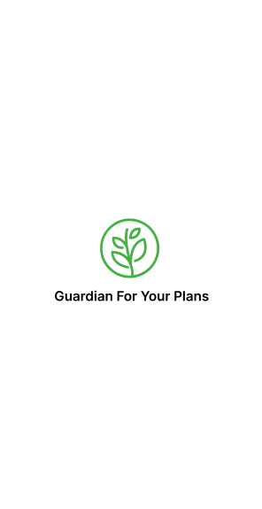

<h1 align="center">
  <br>
  <a href="#"></a>
	
  <br>
  Green Guardian
  <br>
</h1>

<h4 align="center">Our new project aim to detect and diagnose plant disease in large field to reduce the use of pest and toxic chemical for sustainable agriculture. It built on top of <a href="https://reactnative.dev/" target="_blank">React Native</a>.</h4>

<p align="center">
  <!-- <a href="#key-features">Key Features</a> • -->
  <!-- <a href="#how-to-use">How To Use</a> • -->
<!--   <a href="#download">Download</a> • -->
  <!-- <a href="#credits">Credits</a> • -->
<!--   <a href="#related">Related</a> • -->
  <!-- <a href="#authors">Authors</a> -->
</p>

<div style="display:flex">
<!--  -->


</div>

## Links to other repo
- [Backend](https://github.com/mrpoponep/plant_diseases?fbclid=IwAR2iN2gUcUpHDWgYG0JHxyr1uNeQgEdr563tB7HTTEvxFWXqa9DoIma4O4A)
- [Forum](https://github.com/qinshihuangtheconqueror/forumdemo?fbclid=IwAR0DcpCzlJjv0VyIB_pdqTC68hTSosqsw4onBXaMLMh97_j3oKsiYHP6pgw)
## Key Features

* Disease Diagnosis
  - With this feature, users can scan the plant and let the model of the app recognize the disease and recommend suitable solution
<!-- * Organize tasks accroding to P.A.R.A structure
  - When users record their upcoming tasks, the virtual assistant will automatically distribute the user's tasks into sections according to the P.A.R.A structure.
* Recommendations:
  - By using users' personal data, the assistant can provide useful recommendations for users.
  - Exercises recommendations: Providing user with manys work out that can be filtered to fit with user
  - Diet recommendation: Check health of user according meal, workout frequency and give strategy and healthy recipes for user  
* Virtual assistant: 
  - The created feature acts as an effective assistant for users with the ability to give accurate answers and perform assigned tasks.
* Cross platform supported!
* Ability to collect data and summarize a document according to the topic user require
* Context search on video and summarize 😎 -->


## Guide
- As current project include react-native-vision-camera which is not expo supported because it's native. We need to switch to deployment build and run development server and test with our device
- How to start development server:

```
npx expo start
```
or for SDK 48 and lower, use:
```
npx expo start --dev-client
```

## Credits

This software uses the following open source packages:

- [React Native](https://reactnative.dev/)
- [Node.js](https://nodejs.org/)
- [React Native Paper](https://reactnativepaper.com/)
- [Redis](https://github.com/redis/redis)

<!-- ## Support

<a href="https://www.buymeacoffee.com/5Zn8Xh3l9" target="_blank"></a>

<p>Or</p> 

<a href="https://www.patreon.com/amitmerchant">
	
</a> -->
<!-- 
## You may also like...

- [Pomolectron](https://github.com/amitmerchant1990/pomolectron) - A pomodoro app
- [Correo](https://github.com/amitmerchant1990/correo) - A menubar/taskbar Gmail App for Windows and macOS -->

## Authors

<!-- - Đỗ Minh Nhật - Frontend Dev + AI Engineer ([@nhatdm22022537](https://github.com/nhatdm22022537))
- Khổng Ngọc Anh - Backend Dev + AI Engineer ([@kanawanttotimetravel](https://github.com/kanawanttotimetravel))
- Phạm Nhật Quang - Backend Dev ([@Legend0fHell](https://github.com/Legend0fHell))
- Nguyễn Quang Ninh - AI Engineer ([@qninhdt](https://github.com/qninhdt))
- Mai Văn Nhật Minh - Frontend Dev + UI/UX Designer ([@Supporter09](https://github.com/Supporter09))

--- -->


> GitHub [@Supporter09](https://github.com/Supporter09) &nbsp;&middot;&nbsp;
<!-- > Twitter [@amit_merchant](https://twitter.com/amit_merchant) -->


